# 🧰 Herramientas Esenciales para Pentesting y Ciberseguridad


**Índice:** [Legal](#-1--disclaimer-legal-y-ético) ·
[Ciclo](#-2--el-ciclo-de-pentesting) · [Recon](#-3--reconocimiento-osint-y-dns) ·
[Nmap](#-4--nmap-el-flujo) · [Netcat](#-5--netcat-la-navaja-suiza) ·
[Nikto](#-6--nikto-escáner-web) · [Avanzadas](#-7--herramientas-avanzadas) ·
[Legales](#-8--documentos-legales) · [Reporte](#-9--reporte-profesional) ·
[Labs](#-10--labs-legales-para-practicar) · [Ética](#-11--prácticas-éticas) ·
[Claves](#-12--puntos-clave) · [Recursos](#-13--recursos) ·
[Casos reales](#-14--casos-reales-conocimiento-general)

---

## ⚖️ 1 · Disclaimer legal y ético

Antes de tocar **una sola tecla**, esto es innegociable:

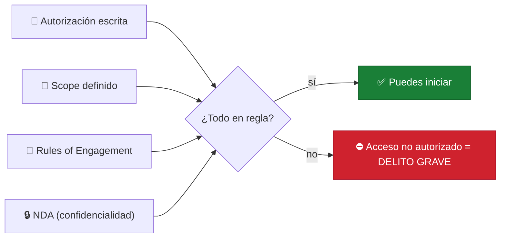

✓ Confidencialidad de hallazgos · ✓ No causar daño · ✓ Reportar responsablemente

---

## 🔄 2 · El ciclo de pentesting

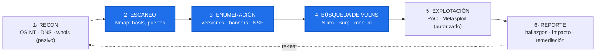

🔵 **En azul: donde estamos hoy en clase** (Nmap y Nikto).

---

## 🔎 3 · Reconocimiento: OSINT y DNS

> ✓ **Legal siempre** — solo información pública. 🎯 El **70%** del pentesting es
> reconocimiento; menos escaneo activo = menos detección.

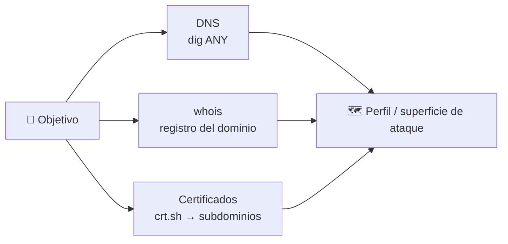

```bash
dig scanme.nmap.org ANY
whois scanme.nmap.org
curl -s 'https://crt.sh/?q=%25.target.com&output=json'
```

---

## 📡 4 · NMAP: el flujo

**¿Qué es?** *Network mapper* — la herramienta #1 del pentesting.

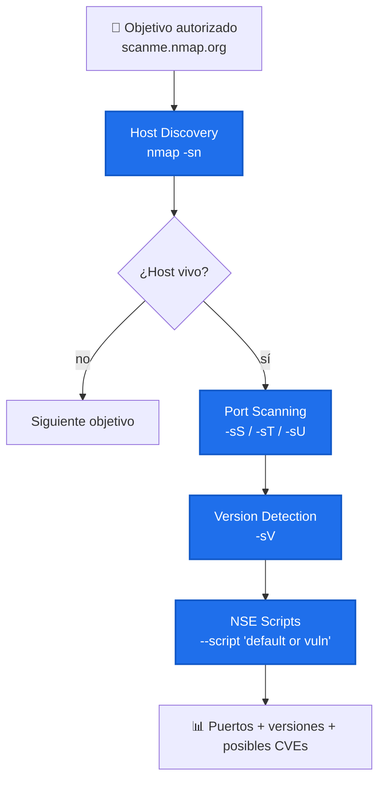

**Host discovery** (ping sweep, ~2-5 s en LAN, ruidoso: ARP/ICMP):
```bash
nmap -sn 192.168.1.0/24
nmap -sn scanme.nmap.org
```
**Port scanning** — 🔵 SYN `-sS` (sigiloso, requiere root) · 🟢 Connect `-sT` (sin
root, más logs) · 🟡 UDP `-sU` (lento). Timing `-T2` (sigilo) → `-T4` (rápido):
```bash
nmap -sS scanme.nmap.org
nmap -sU -p 53,123 scanme.nmap.org
```
**Version + NSE** (buscar CVEs: versión + [cve.mitre.org](https://cve.mitre.org/)):
```bash
nmap -sV scanme.nmap.org
nmap --script "default or vuln" scanme.nmap.org
```
**Escaneo completo (real world, ~15-20 min)** — salida en 3 formatos:
```bash
nmap -A -p- -sV --script "default or vuln" -T3 -oA results scanme.nmap.org
# -A todo · -p- 65535 puertos · -oA results.{nmap,xml,gnmap}
```

---

## 🔧 5 · NETCAT: la navaja suiza

**¿Qué es?** Utilidad universal para TCP/UDP.

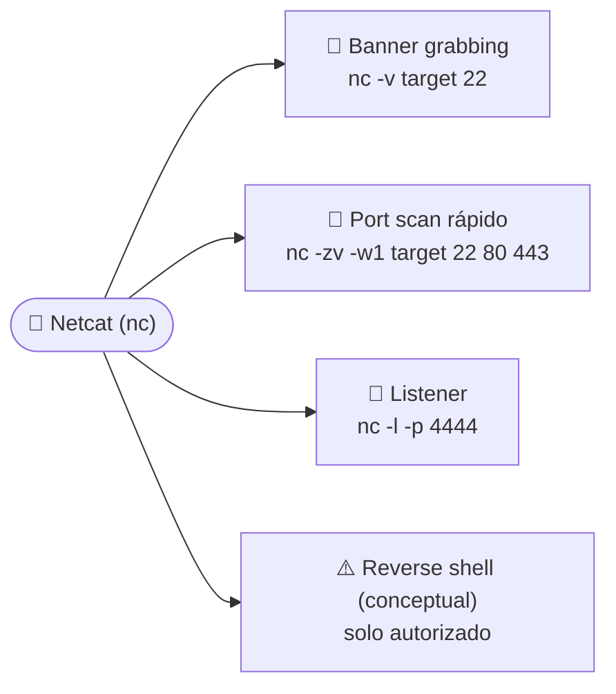

```bash
# Banner grabbing
echo -e 'GET / HTTP/1.0\r\n\r\n' | nc target 80
nc -v target 22
# Listener + conexión desde otra terminal
nc -l -p 4444
nc localhost 4444
```
✓ Alternativa moderna: **ncat** (Nmap) o **socat**.

---

## 🕷️ 6 · NIKTO: escáner web

Escaneo **automático** de vulnerabilidades web. ⚠️ Muy ruidoso (lo detectan
IDS/WAF) y con **muchos falsos positivos** → verificar a mano.

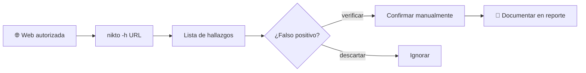

```bash
nikto -h http://target.com -output report.html
nikto -h http://target.com -Tuning 1,2,3   # más selectivo / menos ruidoso
```

---

## 🧩 7 · Herramientas avanzadas

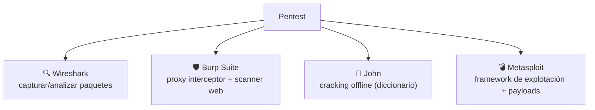

---

## 📋 8 · Documentos legales

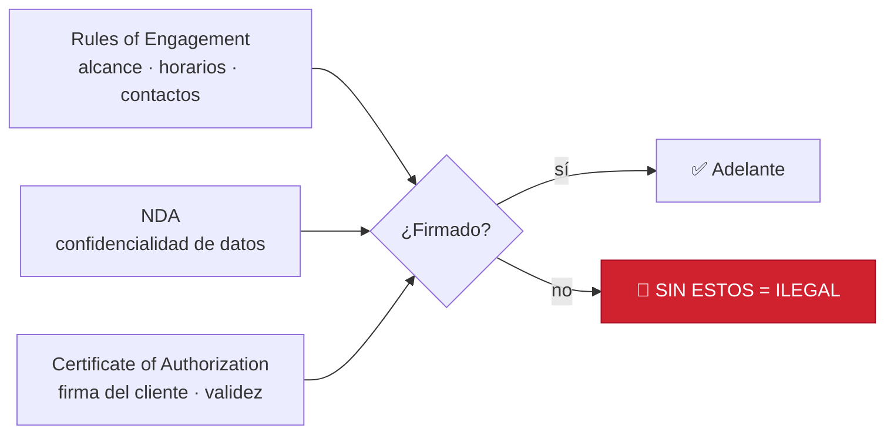

---

## 📝 9 · Reporte profesional

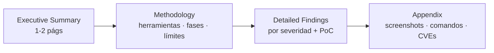

---

## 🧪 10 · Labs legales para practicar

🟢 **Gratuitos:** [`scanme.nmap.org`](http://scanme.nmap.org) (target oficial Nmap) ·
DVWA (web vulnerable, Docker) · Metasploitable (Linux vulnerable)
🟡 **Freemium:** [TryHackMe](https://tryhackme.com/) · [Hack The Box](https://www.hackthebox.com/)

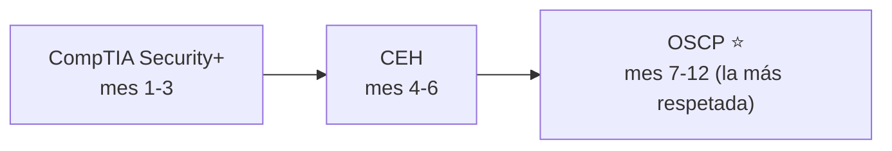

---

## ✅ 11 · Prácticas éticas

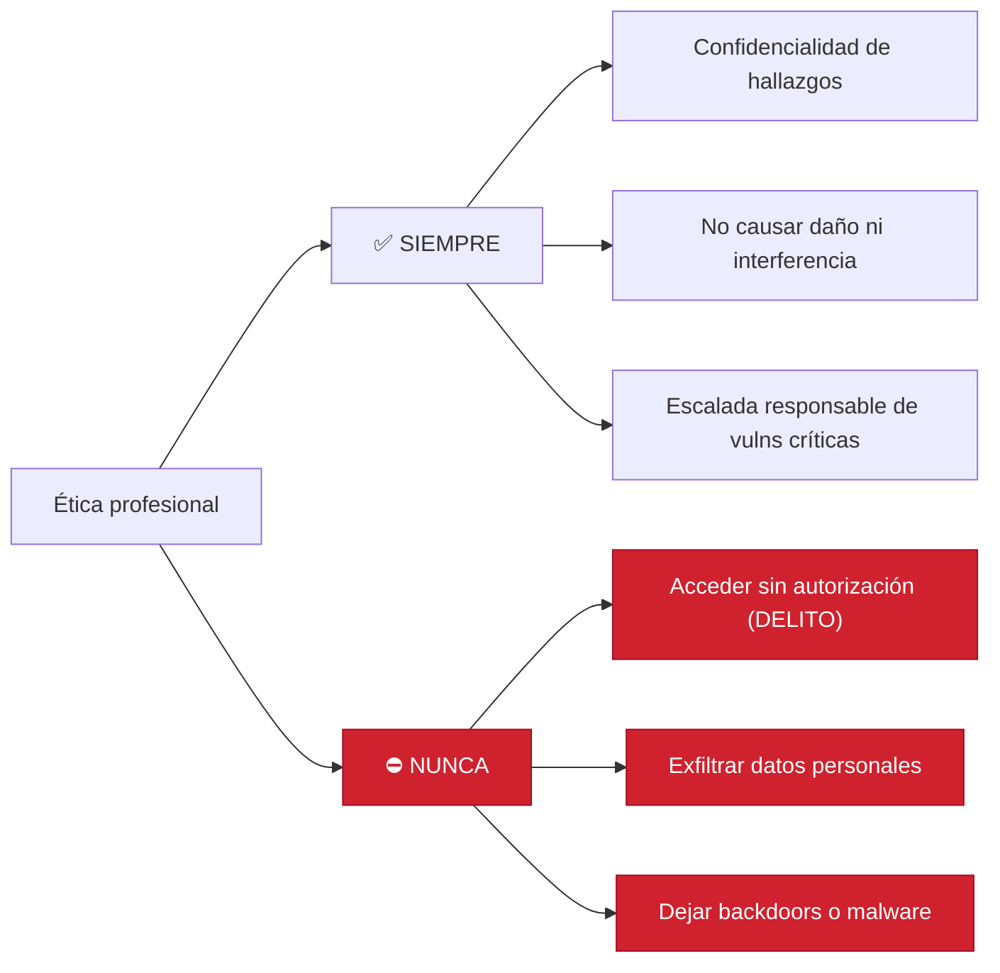

---

## 🎯 12 · Puntos clave

- 🎯 **Nmap** es ~70% del pentesting.
- 🎯 **OSINT** (pasivo) ≈ 60% del reconocimiento.
- 🎯 **Ética y legalidad** son *non-negotiable*.
- 🎯 Un **reporte profesional** = valor real para el cliente.
- 🎯 Certificaciones (**CEH → OSCP**) abren puertas.
- 🎯 Practica **siempre** en labs legales.

---

## 📚 13 · Recursos

📖 [nmap.org/book](https://nmap.org/book/) · [owasp.org](https://owasp.org/) ·
[cve.mitre.org](https://cve.mitre.org/)
🔗 Comunidades: r/cybersecurity · capítulos locales de OWASP · Black Hat / DEF CON
💻 **Next steps:** practica en labs → certifícate (CEH → OSCP) → construye portfolio

---

## 🌍 14 · Casos reales (conocimiento general)

Incidentes **públicos y bien documentados**. El enfoque aquí es **defensivo**: el
mismo reconocimiento y escaneo que un pentester hace **con autorización** revela
justo las exposiciones que estos ataques aprovecharon. Estudiarlos enseña **qué
arreglar**, no cómo atacar.

| Caso (año) | Qué pasó (alto nivel) | Exposición que se aprovechó | 🛡️ Lección defensiva |
|---|---|---|---|
| **WannaCry** (2017) | Ransomware-gusano que se propagó solo por miles de equipos | Servicio **SMB (puerto 445)** sin parchear expuesto en red | Parchear a tiempo, deshabilitar SMBv1, **segmentar** la red |
| **Equifax** (2017) | Brecha de ~147M de registros personales | Componente **web sin parchear** (framework desactualizado) | Inventario de software + **gestión de parches** en apps web |
| **Mirai** (2016) | Botnet de dispositivos IoT usada para ataques masivos | **Telnet (23)** abierto con **credenciales por defecto** | Cambiar credenciales por defecto, **cerrar Telnet**, actualizar IoT |
| **Log4Shell** (2021) | Búsqueda masiva en internet de sistemas vulnerables | Librería **Log4j** vulnerable en apps expuestas | Parcheo urgente, **SBOM** (inventario de dependencias), WAF |
| **Colonial Pipeline** (2021) | Interrupción de infraestructura crítica | Cuenta de **acceso remoto (VPN)** con contraseña filtrada y **sin MFA** | **MFA** en todo acceso remoto, rotación de credenciales, monitoreo |

### Cómo se conecta con lo que vimos hoy

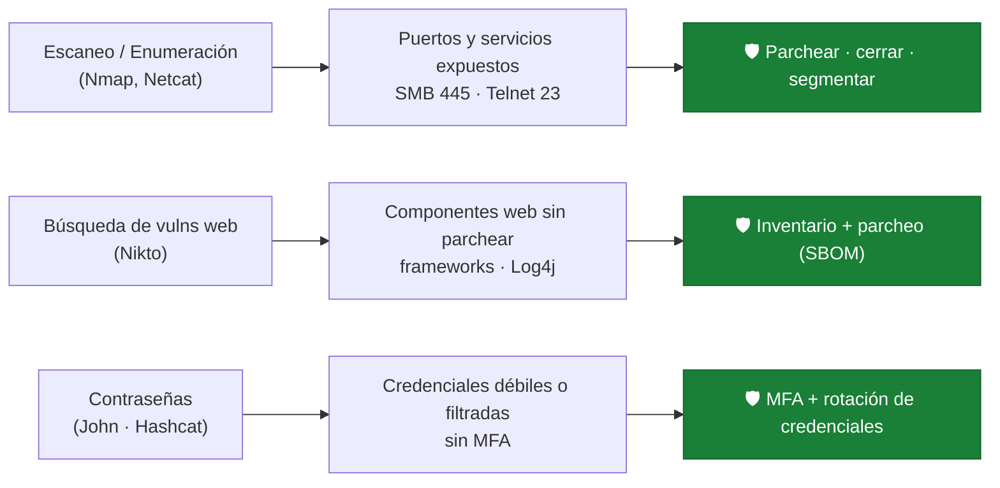

> 💡 **La idea clave:** la herramienta no es "buena" ni "mala". Un pentester ético
> usa Nmap, Netcat o Nikto para **encontrar y cerrar** estas brechas **antes** que
> un atacante. Ese es el trabajo. 🛡️

---

> **¿Preguntas?** 🙌 Recuerden: **ciberseguridad ofensiva = Ética + Técnica.**
> Para la parte práctica de hoy, ver [`ASSIGNMENT-01.md`](ASSIGNMENT-01.md) y
> [`ONLINE-LABS.md`](ONLINE-LABS.md).
